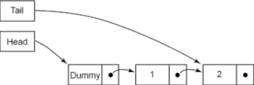
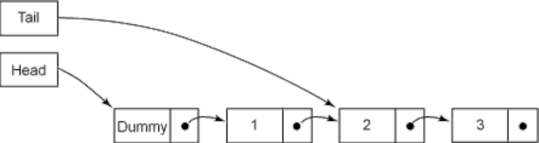
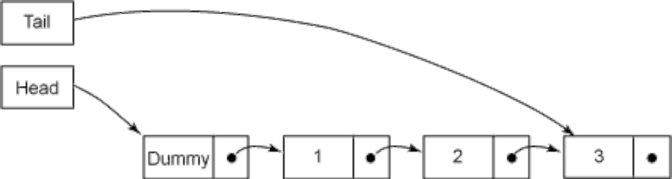

# Introduction to nonblocking algorithms

### *Brian Goetz*

When more than one thread accesses a mutable variable, all threads must use synchronization, or else some very bad
things can happen. The primary means of synchronization in the Java language is the `synchronized` keyword (also known
as *intrinsic locking*), which enforces mutual exclusion and ensures that the actions of one thread executing a
`synchronized`block are visible to other threads that later execute a `synchronized` block protected by the same lock.
When used properly, intrinsic locking can make our programs thread-safe, but locking can be a relatively heavyweight
operation when used to protect short code paths when threads frequently contend for the lock.

In "Going atomic,"we looked at *atomic variables*, which provide atomic read-modify-write operations for safely updating
shared variables without locks. Atomic variables have memory semantics similar to that of volatile variables, but
because they can also be modified atomically, they can be used as the basis for lock-free concurrent algorithms.

## A nonblocking counter

`Counter` in Listing 1 is thread-safe, but the need to use a lock irks some developers because of the performance cost
involved. But the lock is needed because increment, though it looks like a single operation, is shorthand for three
separate operations: fetch the value, add one to it, and write the value out. (Synchronization is also needed on
the `getvalue` method, to ensure that threads calling `getvalue` see an up-to-date value. Simply ignoring the need for
locking is not a good strategy, though many developers seem disturbingly willing to convince themselves that this
approach is acceptable.)

When multiple threads ask for the same lock at the same time, one wins and acquires the lock, and the others block. JVMs
typically implement blocking by suspending the blocked thread and rescheduling it later. The resulting context switches
can cause a significant delay relative to the few instructions protected by the lock.

Listing 1. A thread-safe counter using synchronization

    public final class Counter {
    private long value = 0;
    
        public synchronized long getValue() {
            return value;
        }
    
        public synchronized long increment() {
            return ++value;
        }
    }

`NonblockingCounter` in Listing 2 shows one of the simplest nonblocking algorithms: a counter that uses the
`compareAndSet()` (CAS) method of AtomicInteger. The `compareAndSet()` method says "Update this variable to this new
value, but fail if some other thread changed the value since I last looked." (See "Going atomic" for more explanation of
atomic variables and compare-and-set.)

Listing 2. A nonblocking counter using CAS

    public class NonblockingCounter {
    private AtomicInteger value;
    
        public int getValue() {
            return value.get();
        }
    
        public int increment() {
            int v;
            do {
                v = value.get();
            }
             while (!value.compareAndSet(v, v + 1));
            return v + 1;
        }
    }

The atomic variable classes are called *atomic* because they provide for fine-grained atomic updates of numbers and
object references, but they are also atomic in the sense that they are the basic building blocks for nonblocking
algorithms. Nonblocking algorithms have been the subject of much research and study for over 20 years but have only
become possible in the Java language as of Java 5.0.

Modern processors provide special instructions for atomically updating shared data that can detect interference from
other threads, and `compareAndSet()` uses these instead of locking. (If all we wanted to do was increment the counter,
`AtomicInteger` offers methods for incrementing, but they are based on `compareAndSet()` just like
`NonblockingCounter.increment()`.)

The nonblocking version has several performance advantages over the lock-based version. It synchronizes at a finer level
of granularity (an individual memory location) using a hardware primitive instead of the JVM locking code path, and
losing threads can retry immediately rather than being suspended and rescheduled. The finer granularity reduces the
chance that there will be contention, and the ability to retry without being descheduled reduces the cost of contention.
Even with a few failed CAS operations, this approach is still likely to be faster than being rescheduled because of lock
contention.

`NonblockingCounter` may be a simple example, but it illustrates a basic characteristic of all nonblocking algorithms --
some algorithmic step is executed speculatively, with the knowledge that it may have to be redone if the CAS is not
successful. Nonblocking algorithms are often called *optimistic* because they proceed with the assumption that there
will be no interference. If interference is detected, they back off and retry. In the case of the counter, the
speculative step is the increment -- it fetches and adds one to the old value in the hopes that the value will not
change while the update is being computed. If it is wrong, it has to fetch the value again and redo the increment
computation.

## A nonblocking stack

A less trivial example of a nonblocking algorithm is `ConcurrentStack` in Listing 3. The `push()` and `pop()` operations
in `ConcurrentStack` are both structurally similar to `increment()` in `NonblockingCounter`, speculatively doing some
work and hoping that the underlying assumptions have not been invalidated when it comes time to "commit" that work.
The `push()` method observes the current top node, constructs a new node to be pushed on the stack, and then, if the
topmost node has not changed since the initial observation, installs the new node. If the CAS fails, it means that
another thread has modified the stack, so the process starts again.

Listing 3. Nonblocking stack using Treiber's algorithm

    public class ConcurrentStack<E> {
    AtomicReference<Node<E>> head = new AtomicReference<Node<E>>();
    
        public void push(E item) {
            Node<E> newHead = new Node<E>(item);
            Node<E> oldHead;
            do {
                oldHead = head.get();
                newHead.next = oldHead;
            } while (!head.compareAndSet(oldHead, newHead));
        }
    
        public E pop() {
            Node<E> oldHead;
            Node<E> newHead;
            do {
                oldHead = head.get();
                if (oldHead == null) 
                    return null;
                newHead = oldHead.next;
            } while (!head.compareAndSet(oldHead,newHead));
            return oldHead.item;
        }
    
        static class Node<E> {
            final E item;
            Node<E> next;
    
            public Node(E item) { this.item = item; }
        }
    }

## Performance considerations

Under light to moderate contention, nonblocking algorithms tend to outperform blocking ones because most of the time the
CAS succeeds on the first try, and the penalty for contention when it does occur does not involve thread suspension and
context switching, just a few more iterations of the loop. An uncontended CAS is less expensive than an uncontended lock
acquisition (this statement has to be true because an uncontended lock acquisition involves a CAS plus additional
processing), and a contended CAS involves a shorter delay than a contended lock acquisition.

Under high contention -- when many threads are pounding on a single memory location -- lock-based algorithms start to
offer better throughput than nonblocking ones because when a thread blocks, it stops pounding and patiently waits its
turn, avoiding further contention. However, contention levels this high are uncommon, as most of the time threads
interleave thread-local computation with operations that contend for shared data, giving other threads a chance at the
shared data. (Contention levels this high also indicate that reexamining your algorithm with an eye towards less shared
data is in order.) The graph in "Going atomic" was somewhat confusing in this regard, as the program being measured was
so unrealistically contention-intensive that it appeared that locks were a win for even small numbers of threads.

A nonblocking linked list The examples so far -- counter and stack -- are very simple nonblocking algorithms and are
easy to follow once you grasp the pattern of using CAS in a loop. For more sophisticated data structures, nonblocking
algorithms are much more complicated than these simple examples because modifying a linked list, tree, or hash table can
involve updating more than one pointer. CAS enables atomic conditional updates on a single pointer, but not on two. So
to construct a nonblocking linked list, tree, or hash table, we need to find a way to update multiple pointers with CAS
without leaving the data structure in an inconsistent state.

Inserting an element at the tail of a linked list typically involves updating two pointers: the "tail" pointer that
always refers to the last element in the list and the "next" pointer from the previous last element to the newly
inserted element. Because two pointers need to be updated, two CASes are needed. Updating two pointers in separate CAS
operations introduces two potential problems that need to be considered: what happens if the first CAS succeeds but the
second fails, and what happens if another thread attempts to access the list between the first and second CAS.

The "trick" to building nonblocking algorithms for nontrivial data structures is to make sure that the data structure is
always in a consistent state, even between the time that a thread starts modifying the data structure and the time it
finishes, and to make sure that other threads can tell not only whether the first thread has finished its update or is
still in the middle of it, but also what operations would be required to complete the update if the first thread went
AWOL. If a thread arrives on the scene to find the data structure in the middle of an update, it can "help" the thread
already performing the update by finishing the update for it, and then proceeding with its own operation. When the first
thread gets around to trying to finish its own update, it will realize that the work is no longer necessary and just
return because the CAS will detect the interference (in this case, constructive interference) from the helping thread.

This "help thy neighbor" requirement is needed to make the data structure resistant to the failure of individual
threads. If a thread arrived to find the data structure in mid-update by another thread and just waited until that
thread finished its update, it could wait forever if the other thread fails in the middle of its operation. Even in the
absence of failure, this approach would offer poor performance because the newly arriving thread would have to yield the
processor, incurring a context switch, or wait for its quantum to expire, which is even worse.

`LinkedQueue` in Listing 4 shows the insertion operation for the Michael-Scott nonblocking queue algorithm, which is
implemented by `ConcurrentLinkedQueue`:

Listing 4. Insertion in the Michael-Scott nonblocking queue algorithm

    public class LinkedQueue <E> {
    private static class Node <E> {
    final E item;
    final AtomicReference<Node<E>> next;
    
            Node(E item, Node<E> next) {
                this.item = item;
                this.next = new AtomicReference<Node<E>>(next);
            }
        }
    
        private AtomicReference<Node<E>> head
            = new AtomicReference<Node<E>>(new Node<E>(null, null));
        private AtomicReference<Node<E>> tail = head;
    
        public boolean put(E item) {
            Node<E> newNode = new Node<E>(item, null);
            while (true) {
                Node<E> curTail = tail.get();
                Node<E> residue = curTail.next.get();
                if (curTail == tail.get()) {
                    if (residue == null) /* A */ {
                        if (curTail.next.compareAndSet(null, newNode)) /* C */ {
                            tail.compareAndSet(curTail, newNode) /* D */ ;
                            return true;
                        }
                    } else {
                        tail.compareAndSet(curTail, residue) /* B */;
                    }
                }
            }
        }
    }

Like many queue algorithms, an empty queue consists of a single dummy node. The head pointer always points to the dummy
node; the tail pointer always points to either the last node or the second-to-last node. Figure 1 illustrates a queue
with two elements under normal conditions:

As Listing 4 shows, inserting an element involves two pointer updates, both of which are done with CAS: linking the new
node from the current last node on the queue (C) and swinging the tail pointer to point to the new last node (D). If the
first of these fails, then the queue state is unchanged, and the inserting thread retries until it succeeds. Once that
operation succeeds, the insertion is considered to have taken effect, and other threads can see the modification. It
still remains to swing the tail pointer to point to the new node, but this task can be considered "cleanup" because any
thread that arrives on the scene can tell whether such cleanup is needed and knows how to do it.

The queue is always in one of two states: the normal, or quiescent, state (Figure 1 and Figure 3) or the intermediate
state (Figure 2). The queue is in the quiescent state before an insertion operation and after the second CAS (D)
succeeds; it is in the intermediate state after the first CAS (C) succeeds. In the quiescent state, the next field of
the link node pointed to by the tail is always null; in the intermediate state, it is always non-null. Any thread can
tell which state the queue is in by comparing `tail.next` to null, which is the key to enabling threads to help other
threads "finish" their operation.

The insertion operation first checks to see if the queue is in the intermediate state before attempting to insert a new
element (A), as shown in Listing 4. If it is, then some other thread must already be in the middle of inserting an
element, between steps (C) and (D). Rather than wait for the other thread to finish, the current thread can "help" it
out by finishing the operation for it by moving the tail pointer forward (B). It keeps checking the tail pointer and
advancing it if necessary until the queue is in the quiescent state, at which point it can begin its own insertion.

The first CAS (C) could fail because two threads are contending for access to the current last element of the queue; in
this case, no change has taken effect, and any threads that lose the CAS reload the tail pointer and try again. If the
second CAS (D) fails, the inserting thread does not need to retry -- because another thread has completed the operation
for it in step (B)!

## Nonblocking algorithms under the hood

If you dive into the JVM and OS, you'll find nonblocking algorithms everywhere. The garbage collector uses them to
accelerate concurrent and parallel garbage collection; the scheduler uses them to efficiently schedule threads and
processes and to implement intrinsic locking. In Mustang (Java 6.0), the lock-based
`SynchronousQueue` algorithm is being replaced with a new nonblocking version. Few developers use `SynchronousQueue`
directly, but it is used as the work queue for thread pools constructed with the `Executors.newCachedThreadPool()`
factory. Benchmark tests comparing cached thread pool performance show that the new nonblocking synchronous queue
implementation offers close to three times the speed over the current implementation. And further improvements are
planned for the release following Mustang, codenamed Dolphin.

## Summary

Nonblocking algorithms tend to be far more complicated than lock-based ones. Developing nonblocking algorithms is a
rather specialized discipline, and it can be extremely difficult to prove their correctness. But many of the advances in
concurrent performance across Java versions come from the use of nonblocking algorithms, and as concurrent performance
becomes even more important, expect to see more nonblocking algorithms used in future releases of the Java platform.

Related topics

* "Going atomic" (developerWorks, Brian Goetz, November 2004): Describes the atomic variable classes added in Java 5. 0
  and the compare-and-swap operation.
* "Simple, Fast, and Practical Non-Blocking and Blocking Concurrent Queues" (Maged M. Michael and Michael L. Scott,
  Symposium on Principles of Distributed Computing, 1996): Details the construction of the nonblocking linked queue
  algorithm illustrated in Listing 4 of this article.
* *Java Concurrency in Practice* (Addison-Wesley Professional, Brian Goetz, Tim Peierls, Joshua Bloch, Joseph Bowbeer,
  David Holmes, and Doug Lea, June 2006): A how-to manual for developing concurrent programs in the Java language,
  including constructing and composing thread-safe classes and programs, avoiding liveness hazards, managing
  performance, and testing concurrent applications.

[Source](https://web.archive.org/web/20201025231012/https://www.ibm.com/developerworks/java/library/j-jtp04186/index.html)